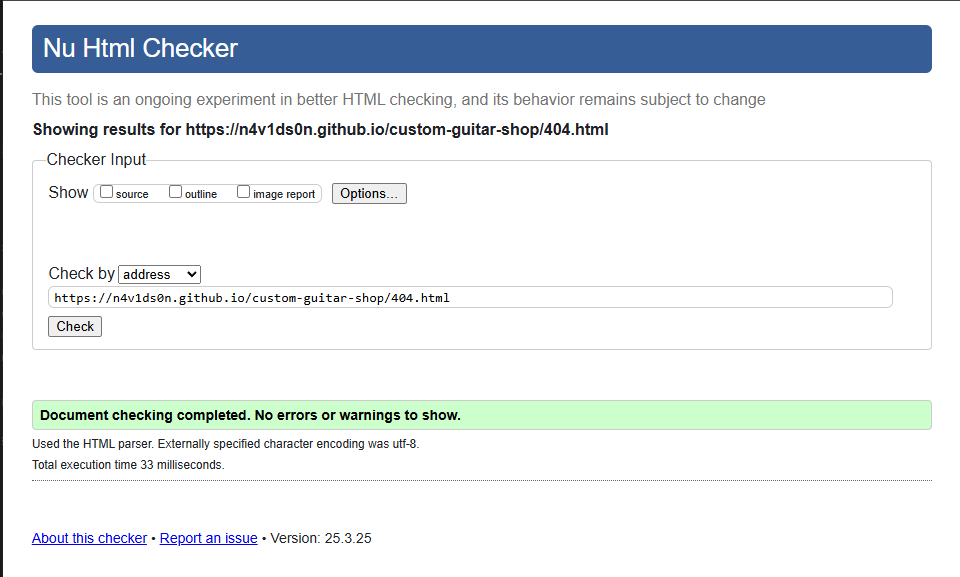
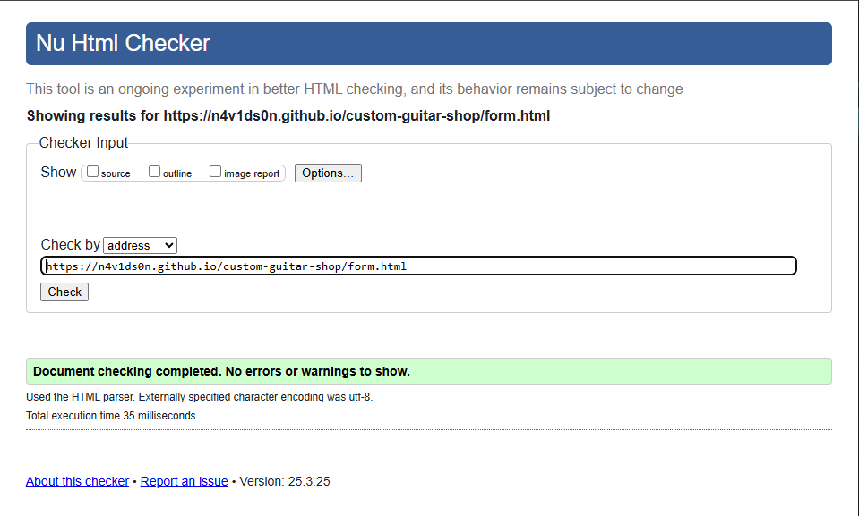
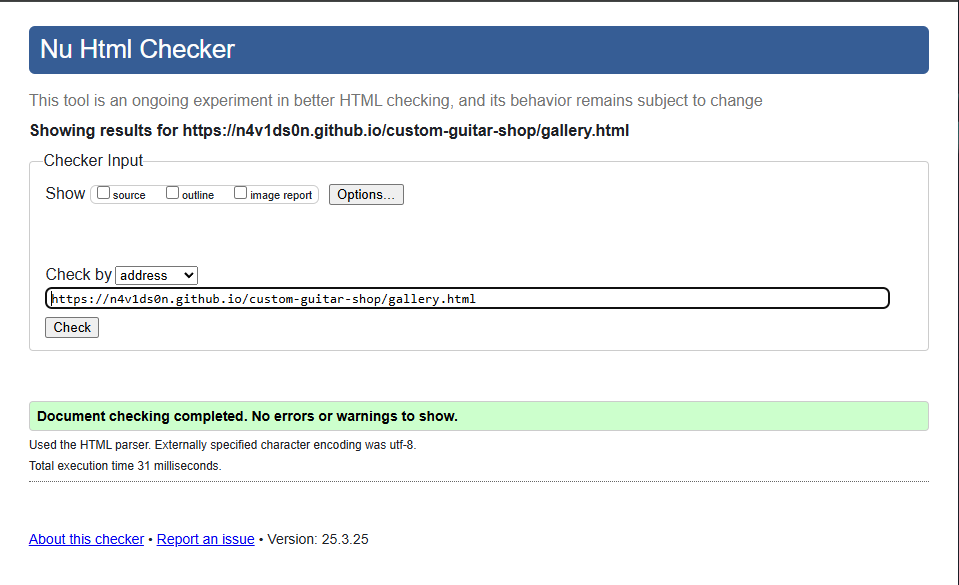
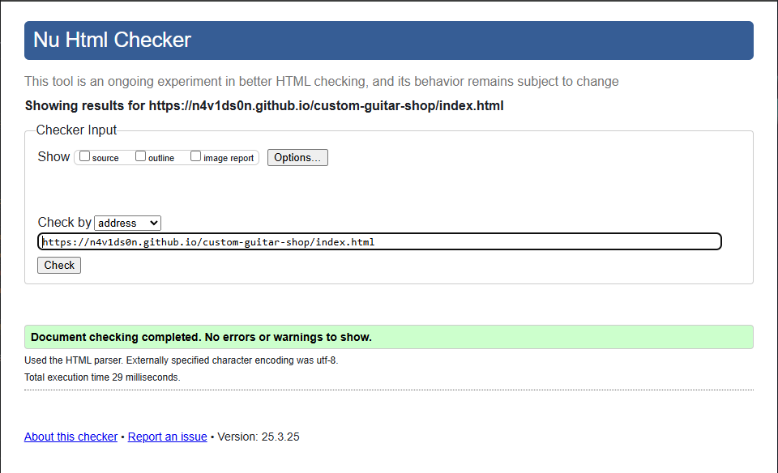
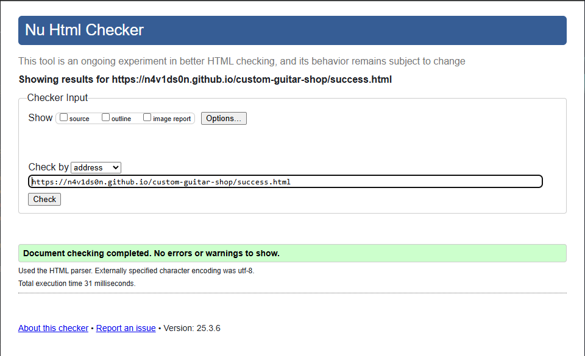

# Testing

> Return back to the [README.md](README.md) file.

## Code Validation

### HTML

[HTML W3C Validator](https://validator.w3.org) was used to validate html pages:

| Directory | File | URL | Screenshot |
| --- | --- | --- | --- |
| root | [404.html](https://github.com/n4v1ds0n/custom-guitar-shop/blob/main/404.html) | [HTML Validator](https://validator.w3.org/nu/?doc=https://n4v1ds0n.github.io/custom-guitar-shop/404.html) |  |
| root | [about.html](https://github.com/n4v1ds0n/custom-guitar-shop/blob/main/about.html) | [HTML Validator](https://validator.w3.org/nu/?doc=https://n4v1ds0n.github.io/custom-guitar-shop/about.html) |  |
| root | [form.html](https://github.com/n4v1ds0n/custom-guitar-shop/blob/main/form.html) | [HTML Validator](https://validator.w3.org/nu/?doc=https://n4v1ds0n.github.io/custom-guitar-shop/form.html) |  |
| root | [gallery.html](https://github.com/n4v1ds0n/custom-guitar-shop/blob/main/gallery.html) | [HTML Validator](https://validator.w3.org/nu/?doc=https://n4v1ds0n.github.io/custom-guitar-shop/gallery.html) |  |
| root | [index.html](https://github.com/n4v1ds0n/custom-guitar-shop/blob/main/index.html) | [HTML Validator](https://validator.w3.org/nu/?doc=https://n4v1ds0n.github.io/custom-guitar-shop/index.html) |  |
| root | [success.html](https://github.com/n4v1ds0n/custom-guitar-shop/blob/main/success.html) | [HTML Validator](https://validator.w3.org/nu/?doc=https://n4v1ds0n.github.io/custom-guitar-shop/success.html) |  |

### CSS

[CSS Jigsaw Validator](https://jigsaw.w3.org/css-validator) was used to validate the custom stylesheet.

| Directory | File | URL | Screenshot |
| --- | --- | --- | --- |
| assets | [style.css](https://github.com/n4v1ds0n/custom-guitar-shop/blob/main/assets/css/style.css) | [CSS Validator](https://jigsaw.w3.org/css-validator/validator?uri=https://n4v1ds0n.github.io/custom-guitar-shop) |  |

