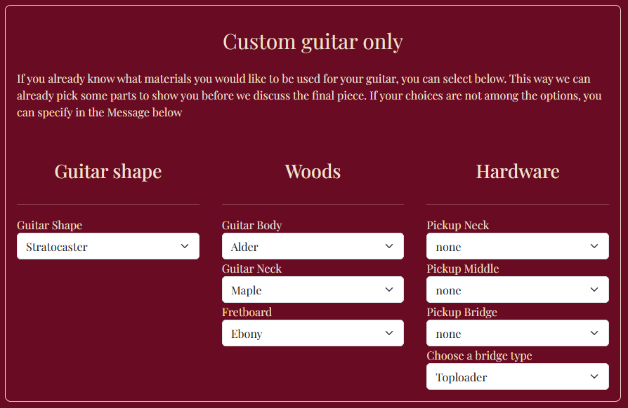

# [custom-guitar-shop](https://n4v1ds0n.github.io/custom-guitar-shop/)

[Page on AmIResponsive](https://ui.dev/amiresponsive?url=https://n4v1ds0n.github.io/custom-guitar-shop)

Welcome to Otto’s Guitar Shop, a custom guitar website built to showcase handcrafted electric guitars, personalized services, and the artistry of master luthier Otto himself.

This site provides a user-friendly platform for musicians and enthusiasts to explore custom guitar builds, view past projects, and connect directly for orders and services.

## Table of Content

1. [Project Goals](#project-goals)
    1. [User Goals](#user-goals)
    2. [Site Owner Goals](#site-owner-goals)
2. [User Experience](#user-experience)
    1. [Target Audience](#target-audience)
    2. [User Requrements and Expectations](#user-requrements-and-expectations)
    3. [User Stories](#user-stories)
3. [Design](#design)
    1. [Design Choices](#design-choices)
    2. [Colour](#colours)
    3. [Fonts](#fonts)
    4. [Structure](#structure)
    5. [Wireframes](#wireframes)
4. [Technologies Used](#technologies-used)
    1. [Languages](#languages)
    2. [Frameworks & Tools](#frameworks-&-tools)
5. [Features](#features)
6. [Testing](#validation)
   
8. [Bugs](#Bugs)
9. [Deployment](#deployment)
10. [Credits](#credits)
11. [Acknowledgements](#acknowledgements)

## Project Goals

### User Goals

- Request a custom or signature guitar
- Customize or setup the users guitar
- Learn about the workshop and luthier
- View exemplary guitars from the shop
- Contact/ get in touch with shop to ask questions, or request services
- get address details to visit Shop
- Subscribe to newsletter

### Site Owner Goals

- Attract new customers and bring in guitar enthusiasts and musicians looking for custom or personalized instruments.
- Use the form to gather contact info and project details from interested customers and generate leads.
- Showcase craftsmanship and unique guitar options to increase demand for high-value, custom orders.
- Communicate brand’s style, values, and expertise in building or modifying guitars.
- Increase visibility online and become a go-to source for boutique guitars and mods.

## User Experience
### Target Audience
- Musicians seeking custom instruments to express their musical identity through a personalized instrument.
- Guitar enthusiasts & collectors who want to add one-of-a-kind pieces to their collection.
- Aspiring musicians who want to own a guitar that matches their identity, even if they’re not experts yet.
- People looking to upgrade or modify their guitars.
- Parents or gift buyers.

### User Requirements and Expectations

- Clear information on offerings making it easy to nderstand what services are provided (e.g. custom builds, modifications, set-ups).
- Easy navigation like a simple, intuitive navigation bar with access to key pages.
- Trust and professionalism for a trustworthy and professional presentation (logos, branding, fonts, consistent design).
- Visual appeal for comfort, see examples of previous work (guitars, shop, craftsmanship).
- Ability to request a quote / custom order
- Mobile compatibility so the site works and looks good on phones and tablets.
- Accessibility, people with disabilities should be able to navigate and use the site.
- Reassurance (Contact Info & Socials) to reach out or check legitimacy via social media.

### User Stories

#### First-time User
1. As a first-time visitor, I want to understand what the shop offers so I can figure out if you build the kind of guitar I’m looking for.

2. As a first-time visitor, I want to learn about your craftsmanship and philosophy so I feel confident trusting you with a custom build.

3. As a first-time visitor, I want to see past guitar builds and shop images so I can get a sense of your style and skills.

4. As a first-time visitor, I want to explore customization options so I can start imagining my dream guitar.

5. As a first-time visitor, I want to easily navigate the site on my phone so I can browse on the go without frustration.

6. As a first-time visitor, I want to send an inquiry or get in touch so I can ask questions or start a custom order, I want some confirmation that my message has been received.

7. As a first-time visitor, I want to find your location and contact info so I can visit the shop or contact you directly.

8. As a first-time visitor, I don't want to get lost so if something does not work, I want to be able to get back to the home page asap.

#### Returning User
9. As a returning visitor, I want to quickly access the contact form so I can follow up or start a new request without searching around.

10. As a returning visitor, I want to subscribe to or read the newsletter so I stay in the loop on shop news and builds.

11. As a returning visitor, I want to share your social links and website, because I’m excited about your guitars.

#### Site Owner

12. As the site owner, I want to showcase my guitar building expertise to build trust and attract clients.

13. As the site owner, I want to provide an easy way for people to contact me so I don’t miss potential custom orders.

14. As the site owner, I want to collect useful details from customers so I can prepare and quote more efficiently.

15. As the site owner, I want to drive traffic through social media links to grow my following and visibility.

16. As the site owner, I want to encourage newsletter signups to build a loyal community of guitar lovers.

## Design

### Design Choices
The website’s design communicates a clear message wrapped in a warm and retro-styled look. The vintage look with high-quality imagery should, inspire creativity, and support user engagement. A detailed form shows that individuality and user input are valued.
Structured layout, consistent styling, and responsive design signal that this is a serious workshop, not a hobbyist page.

### Colour
As core- colors dark green and red colours in combination with cream/beige tones evoke a vintage, handcrafted vibe — cozy and welcoming, like aged wood or classic amps.  
The high contrast gives the site a profesional and accessible look.

### Fonts
The combination of elegant typography like Playfair Display and Yesteryear fonts gives a sense of artisanal quality and custom design.

### Structure
The website follows a clear, user-friendly structure:
- Index (Home): A welcoming introduction to the luthier and his offerings.
- About: In-depth details about the shop's philosophy and craftsmanship.
- Gallery: Detailed images of various guitars, organized by type, with modals for closer inspection.
- Contact form: A form for customer inquiries, along with location and contact information.

### Wireframes

index

about

gallery

form

## Technologies used

### Languages
- HTML
- CSS

### Frameworks and Tools
- Bootstrap v5.0 (navbar and footer)
- Git (repo management)
- GitHub (storage and deployment)
- CorelDraw2024 (designing icons and logos)
- Balsamiq (wireframing)
- Google Fonts 
- Favicon.io
- Font Awesome (Social Media Icons)
- OpenAI (Picture generation and research)
- Coolors (creation of color palette)

## Features
The Website includes four pages plus the comfirmation page after form hand-in and a 404- not foud page for bad links.
There are sixteen features implemented at this stage. 

### Logo and Navigation Bar
- this feature can be found on every page, adapted to each pages requirements.
- the navbar is collapsable for smaller screens and fully responsive, links are available according to current page.
- ensures easy navigation.
- it has a hover function to highlight links
(Relevant user stories: 5, 9)

### Hero Image and Slogan
- Invites the user to the workshop and shows the style of the shop.
- The slogan gives the user an idea of the store philosophy.
(Relevant user stories: 1, 3)

### Custom Guitar Section
- Informs the user about custom guitars in general.
- gives the user an idea what visions can be made possible.
- provides link to get in contact.
(Relevant user stories: 1, 2, 4, 9)

### Signature Guitar Section
- Informs the user that the shop also creates affordable signature guitars
- Refers to the physical store.
(Relevant user stories: 1, 2,)

### Customization Section
- Informs user that existing guitars can be customized in the workshop.
- Refers to contact form
(Relevant user stories: 1, 2, 4, 9)

### Guitar Setup Section
- Informs user that shop offers setup of users guitars in the workshop workshop.
- Refers to contact form
(Relevant user stories: 1, 2, 9)

### Luthier Section
- Introduces the user to the resident luthier.
- shares the philosophy and background story of the Artisan.
(Relevant user stories: 1, 2)

### Footer
- Provides contact information for the users.
- Store address.
- Link to contact form.
(Relevant user stories: 7, 9, 11, 15)

### Header
- quick and easy navigation to subsections of about page and gallery page respectively.
(Relevant user stories: 5)

### Woods Section
- Gives the user some knowledge of the importance of woods for the crafting process and tone.
- Shows some exemplary woods.
(Relevant user stories: 4)

 
### Pickups Section
- Gives the user basic knowledge of guitar pickups and how they affect the sound of the instrument.
- pickup-collage.
(Relevant user stories: 4)

### Hardware Section
- Gives the user an idea of how the hardware affects play and feel of a guitar.
- Shows a guitar bridge.
(Relevant user stories: 4)

### Gallery
- Shows a selection of guitars built by the luthier.
- Shows different available styles with example images.
- Images can be enlarged via modal.
(Relevant user stories: 1, 2, 3, 4, 12)

### Contact Form
- Gives the user the possibility to get in contact
- Requires name and email
- Offers a selection between custom guitar, signatuire guitar, customization and setup (pic. 1).
- Provides a mask for a preconfiguration of a custom guitar (pic. 2).
- Free text field for special requirements (pic 3).
- Signup for a newsletter (pic. 4).
(Relevant user stories: 4, 6, 10, 13, 14, 16)

### Confirmation Page
- Gives the user some feedback that data has been sent and contact has been established.
- Offers full navigation options to get back.
(Relevant user stories: 6)

### 404 Page
- Informs the user of a bad link and offers navigation back to other pages.
(Relevant user stories: 8)

## Validation

Please refer to [testing.md](TESTING.md) file.

## Bugs
| *Bug* | *Fix* |
| ----------- | ----------- |
| On large screens navbar-title moves left | Add absolute positioning to title to overwrite auto setting|
| On large screens luthier-image grows to full screen size | Add a media query to fix image size on larger screens |
| Images in workshop section are misaligned | Adjust picture margin and align pictures in wood and hardware section to the right |
| Footer of contact form shows "contact us" link | Remove div containing link and restyle following div to keep styling |
| A gap between form and footer appears in the background | Set margin bottom of child "additional"-div to zero |

## Deployment
The website has been deployed on GitHub Pages. This can be done in the settings of the repository.
1. In settings choose Pages
2. Set the source to master
3. Refres the page and at the top it should say: "Your site is published at https://username.github.io/repo-name/"
- note that unless you're on a pro plan you can only publish on pages, if your repo is public.

If you are interested in forking the repository this can be done in the repo itself. There is a button in the top right corner resembling a forked road.

You can clone the repository by following these steps:

1. Go to the GitHub repository.
2. Locate and click on the green "Code" button at the very top, above the commits and files.
3. Select whether you prefer to clone using "HTTPS", "SSH", or "GitHub CLI", and click the "copy" button to copy the URL to your clipboard.
4. In your IDE open "Git Bash" or "Terminal".
5. Make sure the current working directory is the location where you want the cloned directory.
6. In your IDE Terminal, type the following command to clone the repository:
    git clone https://www.github.com/username/repo-name
7. Press "Enter" to create your local clone.

## Credits

### Media
- All images are owned and created by the developer.
- Icons used for social media links in footer: [Font Awesome](https://fontawesome.com/)

### Code
- The navbar code was taken from Bootstrap v5.0 library and adjusted to individual needs
- The code to create the 404 permalink in 404.md was created with the help of chatgpt
- The projects love running and boardwalk games helped with inspiration for design concepts

## Acknowledgements

Last but not least I would like to thank :
- My mentor Mo Shami for his very helpful advice and guidance as well as feedback on my work.
- I would like to thank my Code Institute fellow students for being a great source of inspiration and all the helpful advice.
- My wife for her design advice and testing the page now and then.
